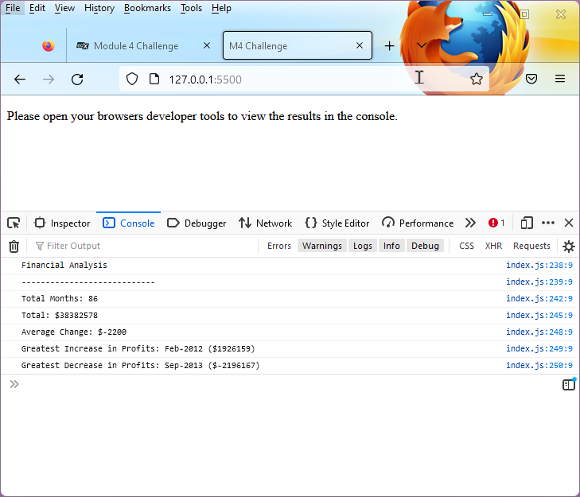

# Challenge - JavaScript Fundamentals: Console Finances

## Description

This tool analyses the financial records of a company. The financial records are composed of an array of records that include the month and corresponding profit & loss for that month.

This app will calculate & display the following in the browser console:

* The total number of months included in the dataset (Total Months).
* The net total amount of Profit/Losses over the entire period (Total).
* The average of the changes in Profit/Losses over the entire period (Average Change).
* The greatest increase in profits (date and amount) over the entire period (Greatest Increase in Profits).
* The greatest decrease in losses (date and amount) over the entire period (Greatest Decrease in Profits).

## Editing records to process

Financial records are stored in the array `finances[]`.

To edit the financial records, edit the array `finances[]` by either appending or deleting extra records.

### Example

`var finances = [`

 `   ['Jan-2010', 867884],`

 `   ['Feb-2010', 234849],`

 `...`

## Live demo

[View deployed application on Github Pages](https://gurdeep-ninja.github.io/Console-Finances/)

## Screenshot

## Installation & running the applcation

Clone or download this project as a zip file & extract to your websites root directory.

Simply open the `index.html` file in your browser and the app will analyse the financial records and output them to the browser console.

## Technologies
  